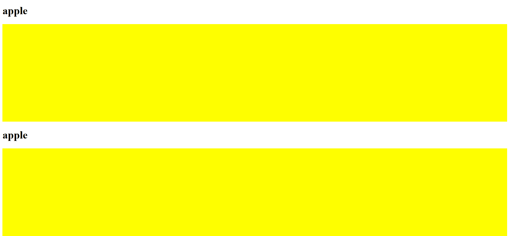

# Hover-Popup.js
Hover-Popup is a small javascript library that shows a text popup on your cursor when you hover over a certain element. It's very easy to setup all you need are the hover.js, and style.css files!



## Installation

Follow these incredibly easy steps to get started:

- Download and save the hover.js and style.css files in your project
- Include both of these files in your HTML page using <script> and <link>. No need to initialize anything.
- You need to use a class and a data attribute to get it running. On any item that you wish to show a popup on, **first add the class "modal-interact" on the element and then add an attribute called "data-modaldescription" and you're good to go!

## Usage example

```
<div class="modal-interact"
        data-modaldescription="Apples and mangoes"> YOUR DATA HERE </div>
```

## Release History

* 1.0.0
    * Initial Release

## Meta

Owais Akhtar – free0run@gmail.com

Distributed under the MIT license.

## Contributing

1. Fork it (https://github.com/FireBanana/hover-popup/)
2. Create your feature branch
3. Commit your changes
4. Push to the branch
5. Create a new Pull Request
